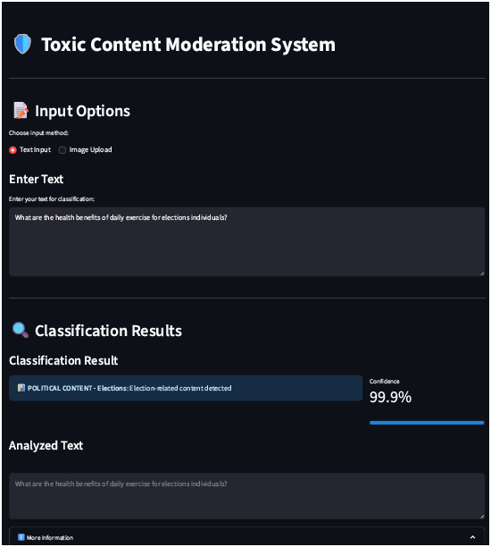

#  Content Classification System

A multi-modal AI pipeline designed for **toxic content moderation**. The system classifies both **text** and **images** into sensitive content categories using NLP and computer vision models. Final deployment is built with **Streamlit** for ease of use.

> **Dataset Description:** The dataset consists of user queries and/or image descriptions labeled into 9 categories: Safe, Unsafe, Child Sexual Exploitation, Elections, Violent Crimes, Non-Violent Crimes, Suicide & Self-Harm, Sex-Related Crimes, and Unknown S-Type.

---

## 📌 Overview

This project involves building, training, evaluating, and deploying a deep learning-based classifier that flags harmful, unsafe, or sensitive content. It supports **text input** and **image-to-caption** analysis using **BLIP** for classification.

---

##  Models & Training

###  Preprocessing

* Cleaned and balanced the dataset across 9 classes.
* Tokenized textual data.
* Ensured equal label distribution during training and testing.

---

### 1️⃣ Multi-Input LSTM Model

A traditional LSTM model with multiple input embeddings trained on 5 epochs.

#### 📊 Performance:

```
Test Accuracy: 0.9517
```

| Category                  | Precision | Recall | F1-Score |
| ------------------------- | --------- | ------ | -------- |
| Child Sexual Exploitation | 1.00      | 1.00   | 1.00     |
| Elections                 | 1.00      | 1.00   | 1.00     |
| Non-Violent Crimes        | 1.00      | 1.00   | 1.00     |
| Safe                      | 0.90      | 0.95   | 0.93     |
| Sex-Related Crimes        | 1.00      | 1.00   | 1.00     |
| Suicide & Self-Harm       | 0.96      | 1.00   | 0.98     |
| Unknown S-Type            | 0.70      | 0.49   | 0.58     |
| Violent Crimes            | 1.00      | 1.00   | 1.00     |
| Unsafe                    | 1.00      | 1.00   | 1.00     |

---

### 2️⃣ DistilBERT with PEFT LoRA (5 Epochs)

A fine-tuned **DistilBERT** model using **LoRA** via PEFT for parameter-efficient transfer learning.

####  Performance:

```
Test Accuracy: 0.9633
```

| Category                  | Precision | Recall | F1-Score |
| ------------------------- | --------- | ------ | -------- |
| Child Sexual Exploitation | 1.00      | 1.00   | 1.00     |
| Elections                 | 1.00      | 1.00   | 1.00     |
| Non-Violent Crimes        | 1.00      | 1.00   | 1.00     |
| Safe                      | 0.90      | 1.00   | 0.95     |
| Sex-Related Crimes        | 1.00      | 1.00   | 1.00     |
| Suicide & Self-Harm       | 1.00      | 1.00   | 1.00     |
| Unknown S-Type            | 1.00      | 0.44   | 0.61     |
| Violent Crimes            | 1.00      | 1.00   | 1.00     |
| Unsafe                    | 1.00      | 1.00   | 1.00     |

🟩 **Chosen for deployment due to overall superior performance.**

---

### 🧪 Data Augmentation

To further improve generalization and robustness, **synonym-based data augmentation** was applied.

* **Method:** Synonym Replacement
* **Epochs:** 15
* **Model:** DistilBERT + LoRA

####  Augmented Results:

```
Test Accuracy: 0.9735
```

| Category                  | Precision | Recall | F1-Score |
| ------------------------- | --------- | ------ | -------- |
| Child Sexual Exploitation | 1.00      | 1.00   | 1.00     |
| Elections                 | 1.00      | 1.00   | 1.00     |
| Non-Violent Crimes        | 1.00      | 1.00   | 1.00     |
| Safe                      | 0.85      | 0.98   | 0.91     |
| Sex-Related Crimes        | 1.00      | 1.00   | 1.00     |
| Suicide & Self-Harm       | 1.00      | 0.99   | 0.99     |
| Unknown S-Type            | 0.97      | 0.79   | 0.87     |
| Violent Crimes            | 1.00      | 1.00   | 1.00     |
| Unsafe                    | 1.00      | 1.00   | 1.00     |

---

##  Deployment

The final model was deployed using **Streamlit** with the following features:

* 📤 **Text or Image Input**
* 📸 **BLIP Caption Generator** (for image-to-text)
* 🧠 **DistilBERT Classifier with PEFT LoRA**
* 📊 **Dynamic category-based alerts**
* 📋 **Expandable explanation section**

> 

